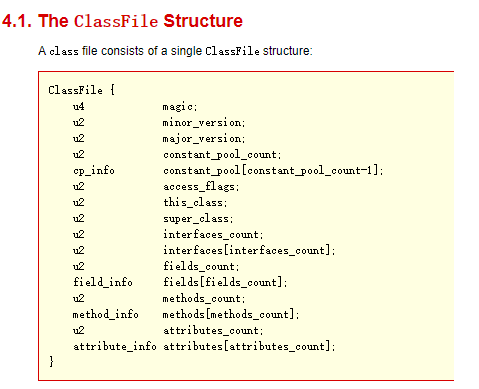
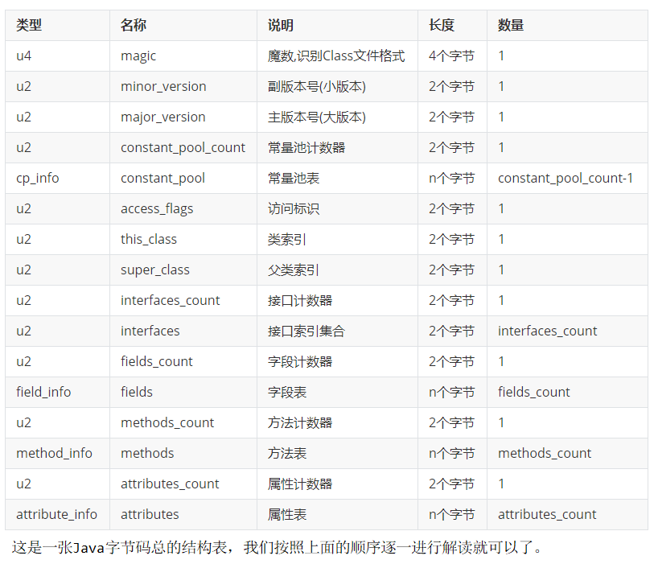

Class文件并不是一成不变的，随着Java虚拟机的不断发展，总是不可避免地会对Class文件结构做出一些调整，但是其基本结构和框架是非常稳定的。

Class文件的总体结构如下：
**魔数：**Magic Number，Class文件的标志，每个Class文件开头的4个字节的无符号整数称为魔数，它唯一的作用是确定这个文件是否为一个能被虚拟机接受的有效合法的Class文件，即class文件标识。

魔数值固定为0xCAFEBABE。不会改变。

如果一个Class文件不以0xCAFEBABE开头，虚拟机在进行文件校验的时候就会直接抛出以下错误：
Error: A JNI error has occurred, please check your installation and try again
Exception in thread "main" java.lang.ClassFormatError: Incompatible magic value 1885430635 in class file StringTest

使用魔数而不是扩展名来进行识别主要是基于安全方面的考虑，因为文件扩展名可以随意地改动。

Class文件版本
常量池
访问标识(或标志)
类索引，父类索引，接口索引集合
字段表集合
方法表集合
属性表集合

