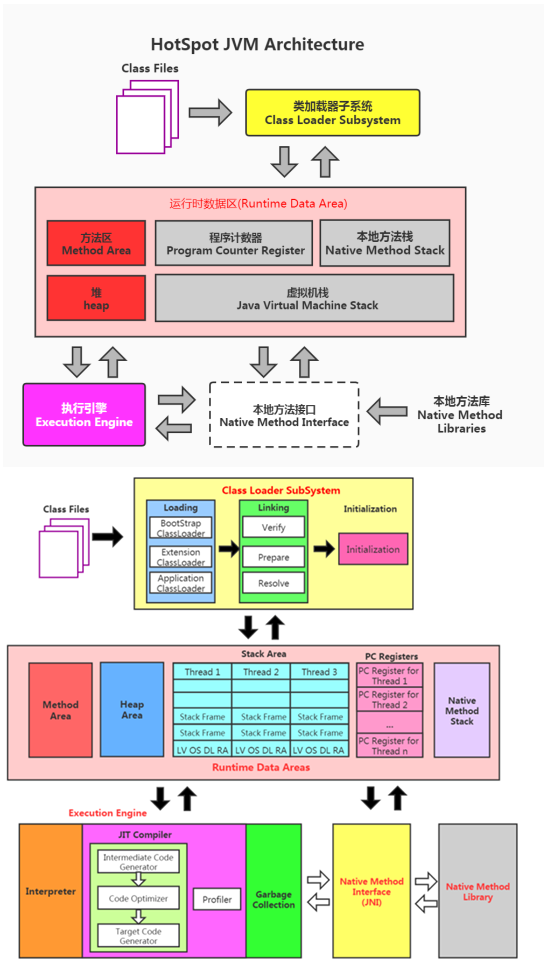

这个架构可以分成三层看：
最上层：javac编译器将编译好的字节码class文件，通过java 类装载器执行机制，把对象或class文件存放在 jvm划分内存区域。
中间层：称为Runtime Data Area，主要是在Java代码运行时用于存放数据的，从左至右为方法区(永久代、元数据区)、堆(共享,GC回收对象区域)、栈、程序计数器、寄存器、本地方法栈(私有)。
最下层：解释器、JIT(just in time)编译器和 GC（Garbage Collection，垃圾回收器）