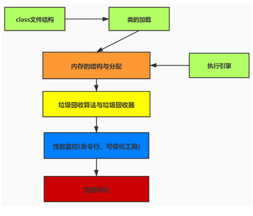

问题：

1. 系统运行突然卡死，无法访问，甚至直接OOM！我们应该怎么去分析思考这个问题。
2. 新项目上线，我们该如何配置JVM参数，直接默认吗。
3. 经常性的去复习JVM知识，但是当问到实际调用的时候无法很号的去解决GC，OOM等问题。
4. 系统如何执行的更快，如何预判系统的瓶颈出现。

虚拟机是指以软件的方式模拟具有完整硬件系统功能，运行一个完全隔离环境中的完整计算机系统，是物理机的实现，常用的虚拟机VMware，Virtual Box，Java Virtual Machine。

JVM的知识脉络：

