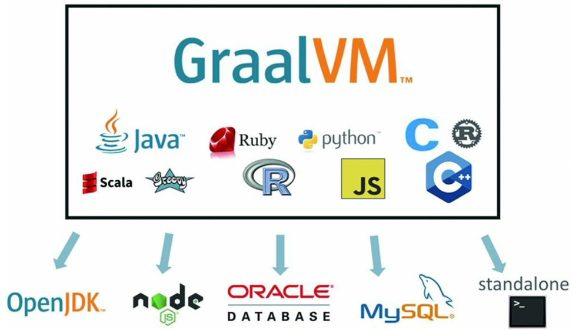

Sun Classic VM  -->解释型
Exact VM   --> Solaris
SUN公司的 HotSpot VM
BEA 的 JRockit  --> 不包含解释器，服务器端，JMC
IBM 的 J9
KVM和CDC/CLDC Hotspot
Azul VM
Liquid VM
Apache Harmony
Microsoft JVM
TaobaoJVM
 Graal VM --> 2018年,“Run Programs Faster Anywhere”

Dalvik VM

其他JVM：
 Java Card VM、Squawk VM、JavaInJava、Maxine VM、Jikes RVM、IKVM.NET、Jam VM、Cacao VM、Sable VM、Kaffe、Jelatine JVM、Nano VM、MRP、Moxie JVM