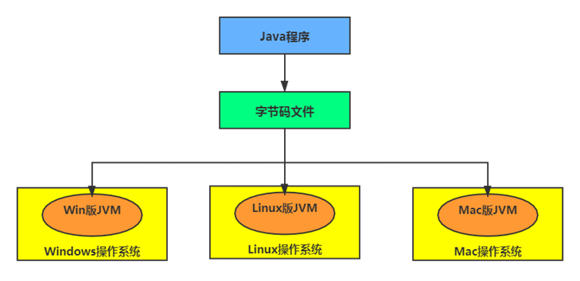
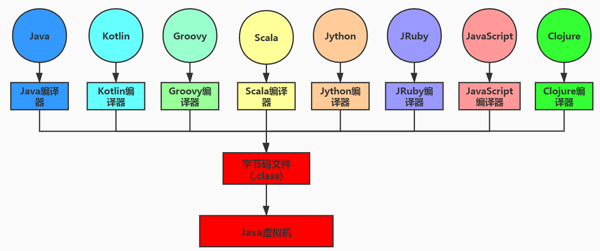

“write once, run anywhere.”

当Java源代码成功编译成字节码后，如果想在不同的平台上面运行，则无须再次编译
这个优势不再那么吸引人了。Python、PHP、Perl、Ruby、Lisp等有强大的解释器。跨平台似乎已经快成为一门语言必选的特性。

Java虚拟机根本不关心运行在其内部的程序到底是使用何种编程语言编写的，它只关心“字节码”文件。

Java不是最强大的语言，但是JVM是最强大的虚拟机。

