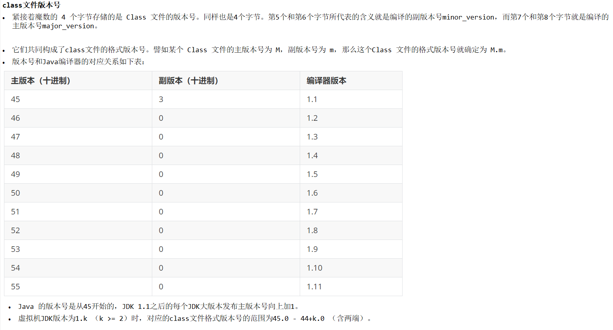

不同版本的Java编译器编译的Class文件对应的版本不一样。目前，高版本的Java虚拟机可以执行由低版本编译器生成的Class文件，但是低版本的Java虚拟机不能执行由高版本编译器生成的Class文件，否则JVM会抛出java.lang.UnsupportedClassVersionError异常。

实际应用中，由于开发环境和生产环境不同，可能导致该问题的发生，因此，我们需要在开发的时候，特别注意开发编译器的JDK版本和生产环境的JDK版本是否一致。

