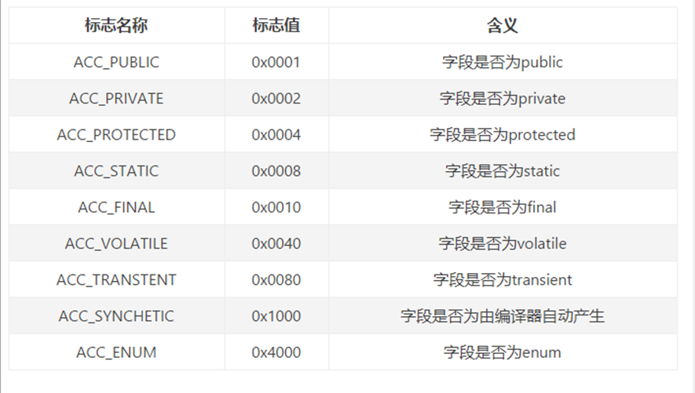

字段表集合

fields
用于描述接口或类中声明的变量。字段（field）包括类级变量以及实例级变量，但是不包括方法内部、代码块内部声明的局部变量。(local variables)
字段叫什么名字、字段被定义为什么数据类型，这些都是无法固定的，只能引用常量池中的常量来描述。
它指向常量池索引集合，它描述了每个字段的完整信息。比如字段的标识符、访问修饰符（public、private或protected）、是类变量还是实例变量（static修饰符）、是否是常量（final修饰符）等。

 注意事项：
字段表集合中不会列出从父类或者实现的接口中继承而来的字段，但有可能列出原本Java代码之中不存在的字段。譬如在内部类中为了保持对外部类的访问性，会自动添加指向外部类实例的字段。
在Java语言中字段是无法重载的，两个字段的数据类型、修饰符不管是否相同，都必须使用不一样的名称，但是对于字节码来讲，如果两个字段的描述符不一致，那字段重名就是合法的。

6.1 fields_count （字段计数器）
fields_count的值表示当前class文件fields表的成员个数。使用两个字节来表示。
fields表中每个成员都是一个field_info结构，用于表示该类或接口所声明的所有类字段或者实例字段，不包括方法内部声明的变量，也不包括从父类或父接口继承的那些字段。

6.2 fields []（字段表）
fields表中的每个成员都必须是一个fields_info结构的数据项，用于表示当前类或接口中某个字段的完整描述。
一个字段的信息包括如下这些信息。这些信息中，各个修饰符都是布尔值，要么有，要么没有。
>作用域（public、private、protected修饰符）
>是实例变量还是类变量（static修饰符）
>可变性（final）
>并发可见性（volatile修饰符，是否强制从主内存读写）
>可否序列化（transient修饰符）
>字段数据类型（基本数据类型、对象、数组）
>字段名称
> 字段表结构
>字段表作为一个表，同样有他自己的结构：

6.2.1 字段表访问标识
我们知道，一个字段可以被各种关键字去修饰，比如：作用域修饰符（public、private、protected）、static修饰符、final修饰符、volatile修饰符等等。因此，其可像类的访问标志那样，使用一些标志来标记字段。字段的访问标志有如下这些：

6.2.2 字段名索引
根据字段名索引的值，查询常量池中的指定索引项即可。

6.2.3 描述符索引
描述符的作用是用来描述字段的数据类型、方法的参数列表（包括数量、类型以及顺序）和返回值。根据描述符规则，基本数据类型（byte,char,double,float,int,long,short,boolean）及代表无返回值的void类型都用一个大写字符来表示，而对象则用字符L加对象的全限定名来表示，如下所示：