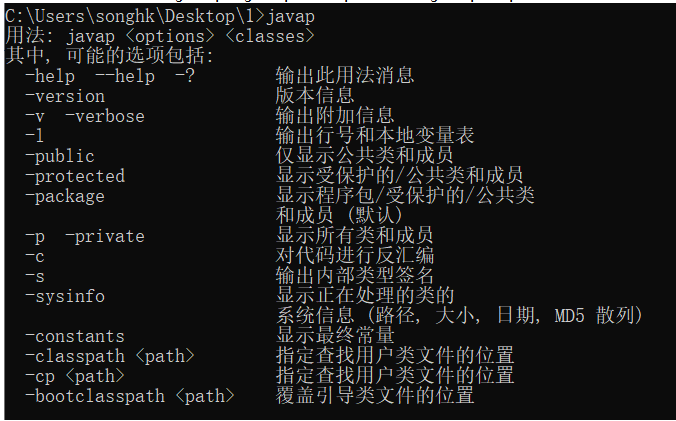

javap的用法格式：
javap <options> <classes>
其中，classes就是你要反编译的class文件。
在命令行中直接输入javap或javap -help可以看到javap的options有如下选项：

这里重组一下：

 -help  --help  -?      输出此用法消息
 -version               版本信息，其实是当前javap所在jdk的版本信息，不是class在哪个jdk下生成的。
 -public                仅显示公共类和成员
 -protected             显示受保护的/公共类和成员
 -p  -private           显示所有类和成员
 -package               显示程序包/受保护的/公共类 和成员 (默认)
 -sysinfo               显示正在处理的类的系统信息 (路径, 大小, 日期, MD5 散列,源文件名)
 -constants             显示静态最终常量

 -s                     输出内部类型签名
 -l                     输出行号和本地变量表
 -c                     对代码进行反汇编
 -v  -verbose           输出附加信息（包括行号、本地变量表，反汇编等详细信息）

 -classpath <path>      指定查找用户类文件的位置
 -cp <path>             指定查找用户类文件的位置
 -bootclasspath <path>  覆盖引导类文件的位置

一般常用的是-v -l -c三个选项。
javap -l 会输出行号和本地变量表信息。
javap -c 会对当前class字节码进行反编译生成汇编代码。
javap -v classxx 除了包含-c内容外，还会输出行号、局部变量表信息、常量池等信息。

1、通过javap命令可以查看一个java类反汇编得到的Class文件版本号、常量池、访问标识、变量表、指令代码行号表等等信息。不显示类索引、父类索引、接口索引集合、<clinit>()、<init>()等结构

2、通过对前面例子代码反汇编文件的简单分析，可以发现，一个方法的执行通常会涉及下面几块内存的操作：
（1）java栈中：局部变量表、操作数栈。
（2）java堆。通过对象的地址引用去操作。
（3）常量池。
（4）其他如帧数据区、方法区的剩余部分等情况，测试中没有显示出来，这里说明一下。

3、平常，我们比较关注的是java类中每个方法的反汇编中的指令操作过程，这些指令都是顺序执行的，可以参考官方文档查看每个指令的含义，很简单：
https://docs.oracle.com/javase/specs/jvms/se7/html/jvms-6.html