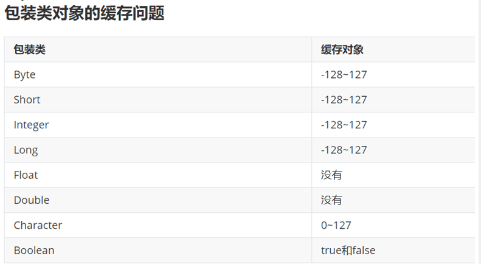

/**
 * @author shkstart

 * @create 12:31
 */
public class ByteCodeInterview {
    //面试题： i++和++i有什么区别？
    @Test
    public void test1(){
        int i = 10;
        i++;
        //++i;

        System.out.println(i);
    }

    @Test
    public void test2(){
        int i = 10;
        i = i++;
        System.out.println(i);
    }

    @Test
    public void test3(){
        int i = 2;
        i *= i++;
        System.out.println(i);
    }

    @Test
    public void test4(){
        int k = 10;
        k = k + (k++) + (++k);
        System.out.println(k);
    }

    //包装类对象的缓存问题
    @Test
    public void test5(){
//        Integer x = 5;
//        int y = 5;

    Integer i1 = 10;
    Integer i2 = 10;
    System.out.println(i1 == i2);

    Integer i3 = 128;
    Integer i4 = 128;
    System.out.println(i3 == i4);

    Boolean b1 = true;
    Boolean b2 = true;
    System.out.println(b1 == b2);
    
}
    
    
    
    @Test
    public void test6(){
    String str = new String("hello") + new String("world");
        String str1 = "helloworld";
    System.out.println(str == str1);
 
 }
 }

再举例：
package com.atguigu.java;

class Father {
    int x = 10;
    public Father() {
        this.print();
        x = 20;
    }
    public void print() {
        System.out.println("Father.x = " + x);
    }
}

class Son extends Father {
    int x = 30;
    public Son() {
        this.print();
        x = 40;
    }
    public void print() {
        System.out.println("Son.x = " + x);

}

}

public class SonTest {
    public static void main(String[] args) {
        Father f = new Son();
        System.out.println(f.x);
    }
} 