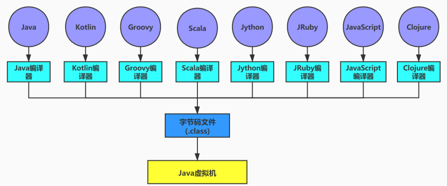

Java虚拟机不和包括Java在内的任何语言绑定，它只是与class文件这种特定的二进制文件格式所关联。

无论使用任何语言开发，只要能将源文件编译成正确的class文件，那么这种语言就可以在java虚拟机上执行。

https://docs.oracle.com/javase/specs/index.html
所有的JVM全部遵守Java虚拟机规范，也就是说所有的JVM环境都是一样的，这样一来字节码文件可以在各种JVM上运行。

从Java虚拟机的角度看，通过Class文件，可以让更多的计算机语言支持Java虚拟机平台。因此，Class文件结构不仅仅是Java虚拟机的执行入口，更是Java生态圈的基础和核心。

字节码是一种二进制文件，是JVM的指令。