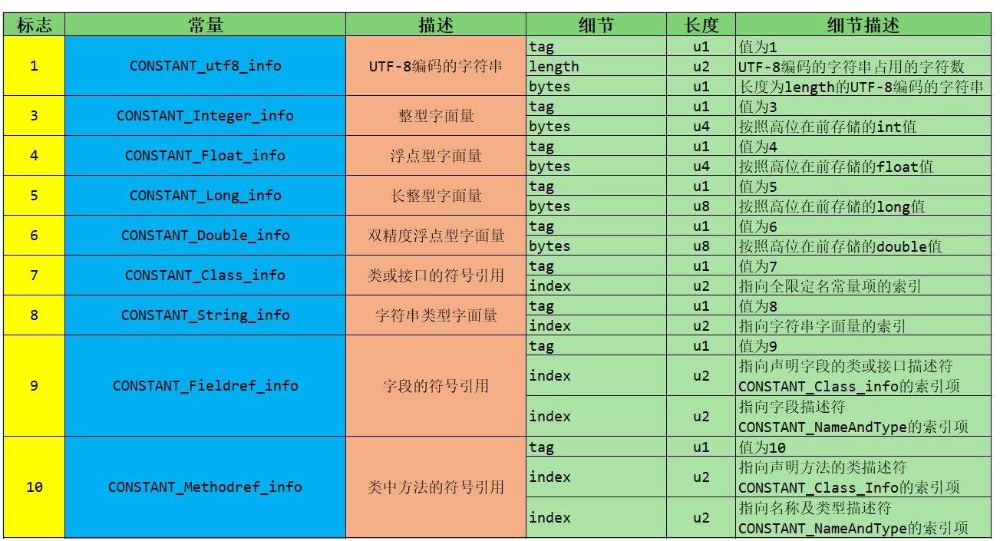
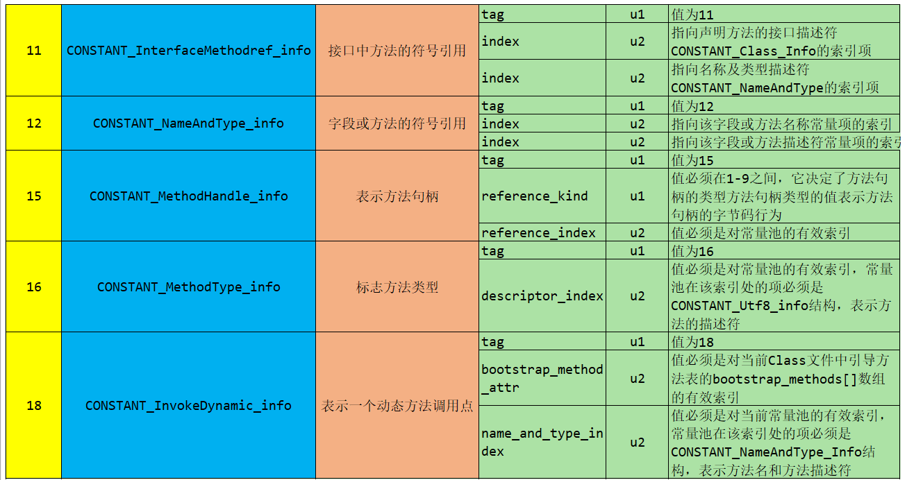

2.2 常量类型和结构
常量池中每一项常量都是一个表，JDK1.7之后共有14种不同的表结构数据。如下表格所示：

根据上图每个类型的描述我们也可以知道每个类型是用来描述常量池中哪些内容（主要是字面量、符号引用）的。比如：CONSTANT_Integer_info是用来描述常量池中字面量信息的，而且只是整型字面量信息。
标志为15、16、18的常量项类型是用来支持动态语言调用的（jdk1.7时才加入的）。
 细节说明：
CONSTANT_Class_info 结构用于表示类或接口
CONSTANT_Fieldref_info、CONSTANT_Methodref_info和CONSTANT_InterfaceMethodref_info结构表示字段、方法和接口方法
CONSTANT_String_info结构用于表示String类型的常量对象
CONSTANT_Integer_info和CONSTANT_Float_info 表示4字节（int和float）的数值常量
CONSTANT_Long_info和CONSTANT_Double_info结构表示8字节(long和double)的数值常量
在class文件的常量池表中，所有的8字节常量均占两个表成员（项）的空间。如果一个CONSTANT_Long_info或CONSTANT_Double_info结构的项在常量池表中的索引位n，则常量池表中下一个可用项的索引位n+2，此时常量池表中索引为n+1的项仍然有效但必须视为不可用的。
CONSTANT_NameAndType_info结构用于表示字段或方法，但是和之前的3个结构不同，CONSTANT_NameAndType_info结构没有指明该字段或方法所属的类或接口。
CONSTANT_Utf8_info用于表示字符常量的值
CONSTANT_MethodHandle_info结构用于表示方法句柄
CONSTANT_MethodType_info结构表示方法类型
CONSTANT_InvokeDynamic_info结构用于表示invokedynamic指令所用到的引导方法(bootstrap method)、引导方法所用到的动态调用名称(dynamic invocation name)、参数和返回类型，并可以给引导方法传入一系列称为静态参数(static argument)的常量。

解析方式：
一个字节一个字节的解析
       
使用javap命令解析：javap -verbose Demo.class 或 jclasslib工具会更方便。

==================================
总结1：
这14种表（或者常量项结构）的共同点是：表开始的第一位是一个u1类型的标志位（tag），代表当前这个常量项使用的是哪种表结构，即哪种常量类型。

在常量池列表中，CONSTANT_Utf8_info常量项是一种使用改进过的UTF-8编码格式来存储诸如文字字符串、类或者接口的全限定名、字段或者方法的简单名称以及描述符等常量字符串信息。

这14种常量项结构还有一个特点是，其中13个常量项占用的字节固定，只有CONSTANT_Utf8_info占用字节不固定，其大小由length决定。为什么呢？因为从常量池存放的内容可知，其存放的是字面量和符号引用，最终这些内容都会是一个字符串，这些字符串的大小是在编写程序时才确定，比如你定义一个类，类名可以取长取短，所以在没编译前，大小不固定，编译后，通过utf-8编码，就可以知道其长度。