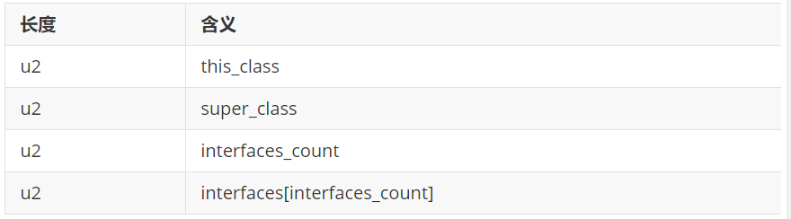

在访问标记后，会指定该类的类别、父类类别以及实现的接口，格式如下：

这三项数据来确定这个类的继承关系。
类索引用于确定这个类的全限定名
父类索引用于确定这个类的父类的全限定名。由于 Java语言不允许多重继承，所以父类索引只有一个，除了java.lang.Object 之外，所有的Java类都有父类，因此除了java.lang.Object 外，所有Java类的父类索引都不为 0。
接口索引集合就用来描述这个类实现了哪些接口，这些被实现的接口将按 implements 语句（如果这个类本身是一个接口，则应当是 extends 语句）后的接口顺序从左到右排列在接口索引集合中。

1.this_class（类索引）
2字节无符号整数，指向常量池的索引。它提供了类的全限定名,如com/atguigu/java1/Demo。this_class的值必须是对常量池表中某项的一个有效索引值。常量池在这个索引处的成员必须为CONSTANT_Class_info类型结构体，该结构体表示这个class文件所定义的类或接口。

2.super_class （父类索引）
2字节无符号整数，指向常量池的索引。它提供了当前类的父类的全限定名。如果我们没有继承任何类，其默认继承的是java/lang/Object类。同时，由于Java不支持多继承，所以其父类只有一个。
superclass指向的父类不能是final。

3. interfaces
指向常量池索引集合，它提供了一个符号引用到所有已实现的接口
由于一个类可以实现多个接口，因此需要以数组形式保存多个接口的索引，表示接口的每个索引也是一个指向常量池的CONSTANT_Class (当然这里就必须是接口，而不是类)。

3.1 interfaces_count (接口计数器)
interfaces_count项的值表示当前类或接口的直接超接口数量。

3.2 interfaces 
interfaces []中每个成员的值必须是对常量池表中某项的有效索引值，它的长度为 interfaces_count。 每个成员 interfaces[i]必须为 CONSTANT_Class_info结构，其中 0 <= i < interfaces_count。在 interfaces[]中，各成员所表示的接口顺序和对应的源代码中给定的接口顺序（从左至右）一样，即 interfaces[0]对应的是源代码中最左边的接口。