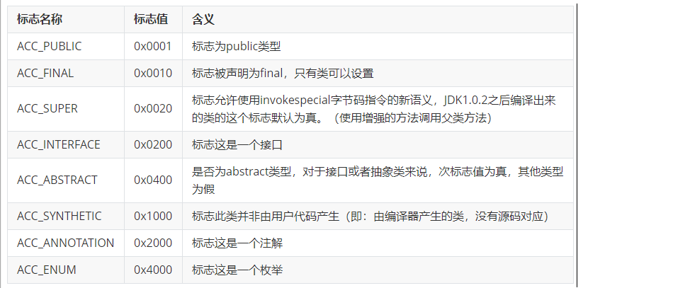

访问标识(access_flag、访问标志、访问标记)

在常量池后，紧跟着访问标记。该标记使用两个字节表示，用于识别一些类或者接口层次的访问信息，包括：这个 Class 是类还是接口；是否定义为 public 类型；是否定义为 abstract 类型；如果是类的话，是否被声明为 final 等。各种访问标记如下所示：

类的访问权限通常为 ACC_ 开头的常量。
每一种类型的表示都是通过设置访问标记的32位中的特定位来实现的。比如，若是public final的类，则该标记为ACC_PUBLIC | ACC_FINAL。
使用ACC_SUPER可以让类更准确地定位到父类的方法super.method(),现代编译器都会设置并且使用这个标记。

补充说明：
1. 带有ACC_INTERFACE标志的class文件表示的是接口而不是类，反之则表示的是类而不是接口。
    1）如果一个class文件被设置了 ACC_INTERFACE 标志，那么同时也得设置ACC_ABSTRACT 标志。同时它不能再设置 ACC_FINAL、ACC_SUPER 或 ACC_ENUM 标志。
    2）如果没有设置ACC_INTERFACE标志，那么这个class文件可以具有上表中除 ACC_ANNOTATION外的其他所有标志。当然，ACC_FINAL和ACC_ABSTRACT这类互斥的标志除外。这两个标志不得同时设置。

2. ACC_SUPER标志用于确定类或接口里面的invokespecial指令使用的是哪一种执行语义。针对Java虚拟机指令集的编译器都应当设置这个标志。对于Java SE 8及后续版本来说，无论class文件中这个标志的实际值是什么，也不管class文件的版本号是多少，Java虚拟机都认为每个class文件均设置了ACC_SUPER标志。
    1）ACC_SUPER标志是为了向后兼容由旧Java编译器所编译的代码而设计的。目前的 ACC_SUPER标志在由JDK 1.0.2之前的编译器所生成的access_flags中是没有确定含义的，如果设置了该标志，那么Oracle的Java虚拟机实现会将其忽略。

3. ACC_SYNTHETIC标志意味着该类或接口是由编译器生成的，而不是由源代码生成的。

4. 注解类型必须设置ACC_ANNOTATION标志。如果设置了 ACC_ANNOTATION标志， 那么也必须设置ACC_INTERFACE标志。

5. ACC_ENUM标志表明该类或其父类为枚举类型。

6. 表中没有使用的access_flags标志是为未来扩充而预留的，这些预留的标志在编译器中应该设置为0, Java虚拟机实现也应该忽略它们。