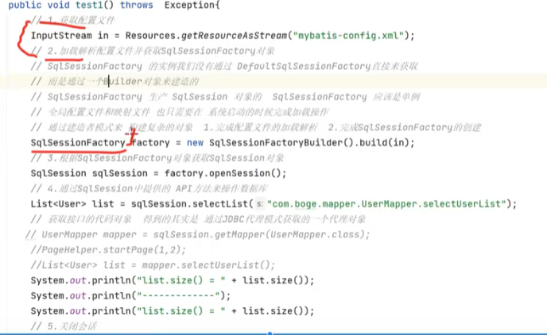

1. 获取配置文件
   参考：[Mybatis-config.xml配置文件基础配置详解-CSDN博客](https://blog.csdn.net/qq_43795348/article/details/109553684)
2. 加载解析配置文件并获取SqlSessionFactory对象（应该是单例），通过SqlSessionFactoryBuiler类构造SqlSessionFactory对象（利用建造者模式），完成配置文件的加载解析。
3. 然后根据SqlSessionFactory对象获取SqlSession对象。
4. 通过SqlSession对象执行映射文件中的SQL，并返回结果。
5. 然后通过SqlSession.close方法关闭SqlSession。

接口层：SqlSession

核心处理层：配置解析，参数映射，SQL解析，SQL执行，结果集映射，插件
基础支持层：数据源模块，事务管理模块，缓存模块，Binding模块，反射模块，类型转换模块，日志模块，资源加载，解析器模块