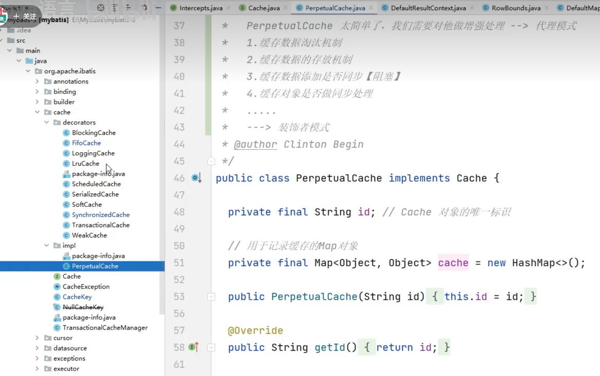
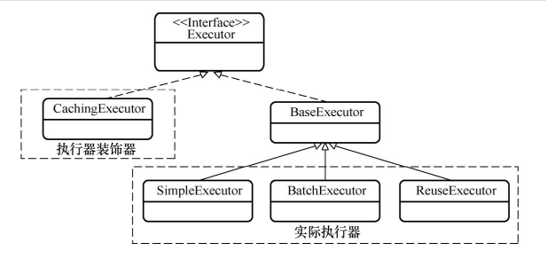
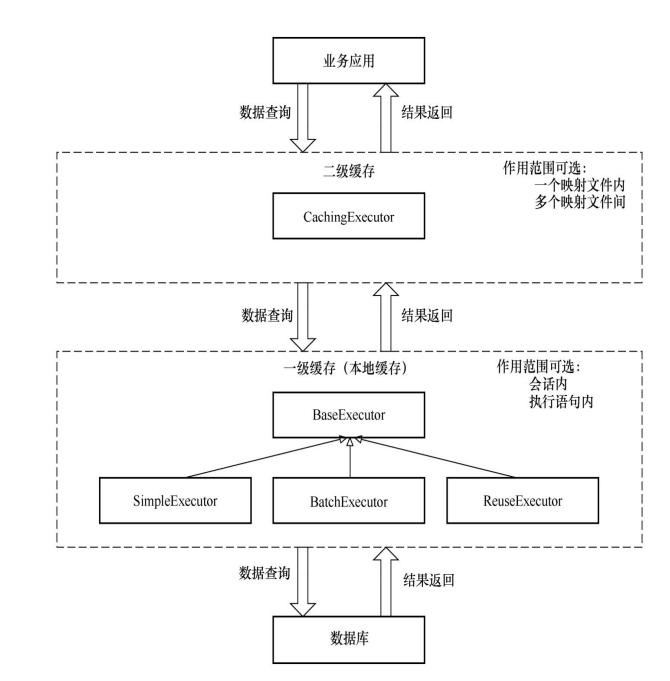
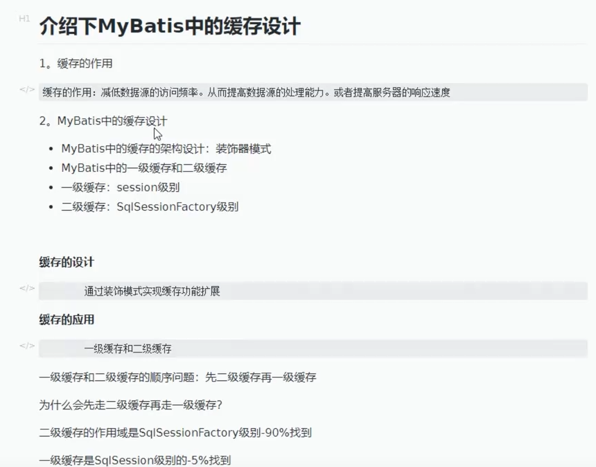

1. 缓存的作用：降低数据源的访问频率，从而提高数据源的处理能力。

2. 缓存的设计：

   

   一级缓存：本地缓存，可以通过配置语句改变一级缓存的作用范围，如session,statement，分别对应一次会话和一条语句，默认是一次会话。
   当我们编写查询语句的时候，可以通过flushCache属性，当属性为true时，MyBatis会在该数据库操作执行前清除一级，二级缓存，默认为false。

   

   一级缓存是由BaseExecutor类实现，BaseExecutor类作为实际执行器的基类，为所有实际执行器提供一些通用的基本功能，在这里增加缓存也就意味着每个实际执行器都具有一级缓存。

   BaseExecutor中对于一级缓存存在两种属性：localCache，localOutputParameterCache，前者是查询操作的结果缓存，后者是Callable查询输出参数缓存。

   二级缓存：它的作用范围是一个命名空间（即一个映射文件），而且可以实现多个命名空间共享一个缓存，因此与一级缓存相比其作用范围更广，选择更加灵活。

   二级缓存默认是开启的，我们可以在配置文件中通过配置CacheEnabled来控制缓存的开启和关闭。也可以在配置项的映射文件内，从过cache标签来声明本命名空间的缓存

   此外我们可以对于Select语句使用useCache="true"来配置数据库操作节点是否开启使用二级缓存。

   flushCache配置项，该配置属性与一级缓存共用，表示是否在语句执行前清除一二级缓存。

   二级缓存的功能是由CachingExecutor类实现，它是一个装饰器类，能通过装饰器实际执行器来为它们增加二级缓存功能。

   CacheingExecutor作为装饰器会先运行，然后才会调用实际执行器，这时BaseExecutor中的方法才会执行，因此我们在数据库查询操作中Mybatis先访问二级缓存再访问一级缓存。

   

   一级缓存与二级缓存对比：

   1. 配置地方（配置项）：一级缓存是配置在setting配置文件中或者在操作节点内增加flushCache属性。二级缓存可以在setting配置文件中，映射文件中，数据库操作节点中以及数据库操作节点的flushCache属性项中。
   2. 开启状态：一级，二级缓存默认是启用的，但是二级可以开启，然而一级缓存无法关闭。
   3. 作用范围：一级缓存session或者statement，前者是会话，后者是语句，默认是前者；而二级缓存的作用范围是一个命名空间（即一个映射文件中），而且可以实现多个命名空间共享一个缓存，所以二级缓存的作用范围更加广，且选择更加灵活。
   4. 访问顺序：因为CacheingExecutor作为装饰器会先运行，然后才会调用实际执行器，此时BaseExecutor中的方法才会执行，所以，在数据库操作中，MyBatis会先访问二级缓存再访问一级缓存。
   5. 