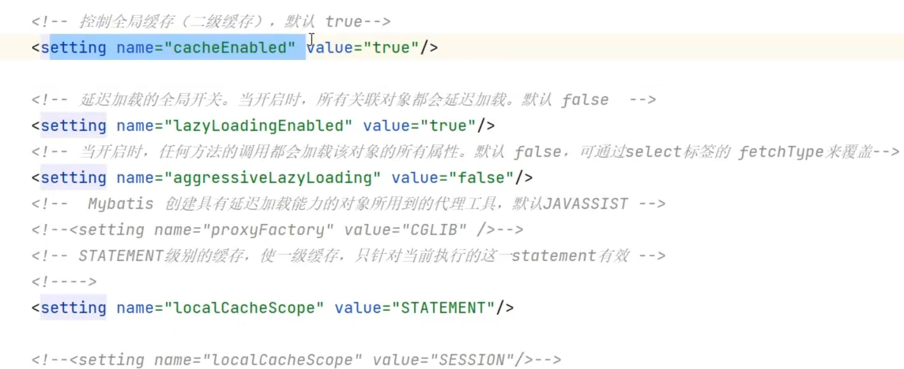
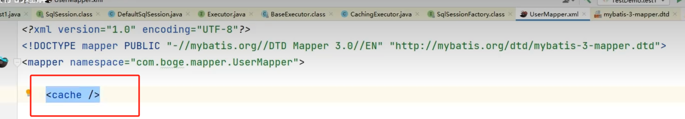
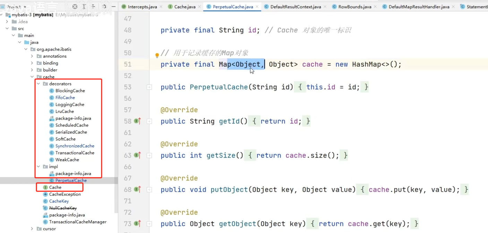
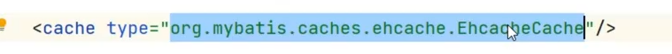

Mybatis的缓存时基于JVM堆内存实现的，会将所有缓存数据都放在Java对象中。缓存采用装饰器模式设计，Cache接口会有一个基本的实现类，即PerpetualCache。通过HashMap存放缓存对象，它重写了equals()方法，当两个缓存对象的Id相同时，即认为缓存对象相同。

缓存的优化：

开启二级缓存

步骤一 setting文件中

步骤二：xml映射文件中

将某个查询的二级缓存关闭：

源码：

通过Redis客户端，将缓存数据放到Redis中。或者放入Ehcache中。实现接口，重写putObject，getObject方法接口。

