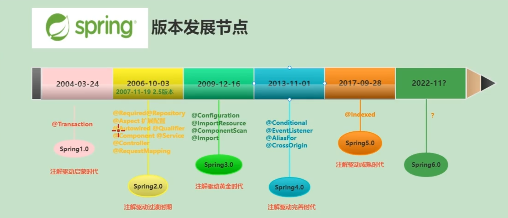

Spring的发展

Spring从单纯的xml配置方式，到现在完全基于注解的编程方式发展。

Spring的组成：Spring是一个轻量级的IOC和AOP容器框架，是为Java应用提供基础性服务的一套框架，目的适用于简化应用程序的开发，使得开发者只需要关心业务。常用的配置方式为：基于XML的配置，基于注解的配置，基于Java的配置。

组成模块：

1. SpringCore：核心类库，提供IOC服务。
2. SpringContext：提供框架式的Bean的访问方式，以及企业级的JNDI，定时任务等。
3. SpringAOP：AOP服务。
4. SpringDAO：对于JDBC的抽象，简化了数据访问异常的处理。
5. SpringORM：对现有ORM框架的支持。
6. SpringWeb：提供了基于Web的综合特性，如文件上传等。
7. SpringMVC：提供了面向Web应用的Model-View-Controller实现。