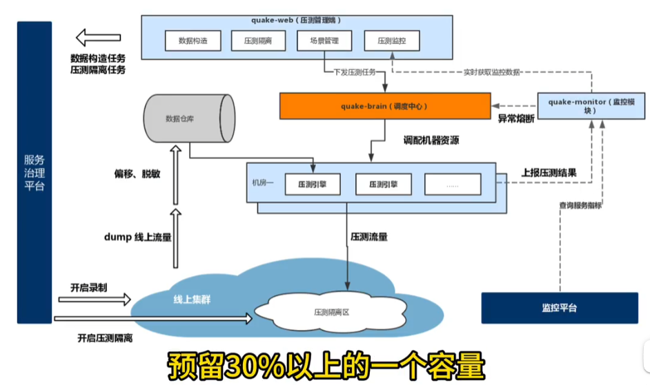

熔断：调用方快速的失败，不去做真正的调用，避免一个节点的失败导致整个调用链路的雪崩，当然熔断之后如何回复呢。

限流：当调用量太大，导致整个系统的负载过高，常见的就是对了加漏斗的方式进行限流。

降级：对大型的系统进行服务的降级，在业务高峰期，将非核心业务隔离开，或者功能直接下线。（如不能修改用户地址，热门商品不允许评论）

参考：

[每年大促必做的事，压测限流应该如何权衡，AI代码分析_哔哩哔哩_bilibili](https://www.bilibili.com/video/BV14Q4y1s7Mz/?spm_id_from=333.999.0.0&vd_source=4caa5043b8a1c275c151a55999790076)