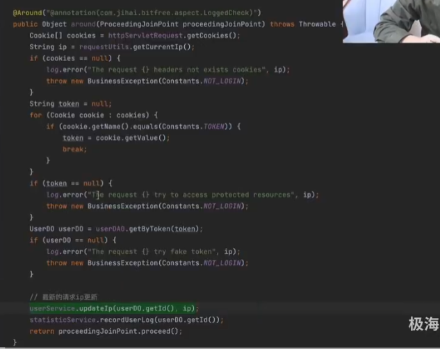
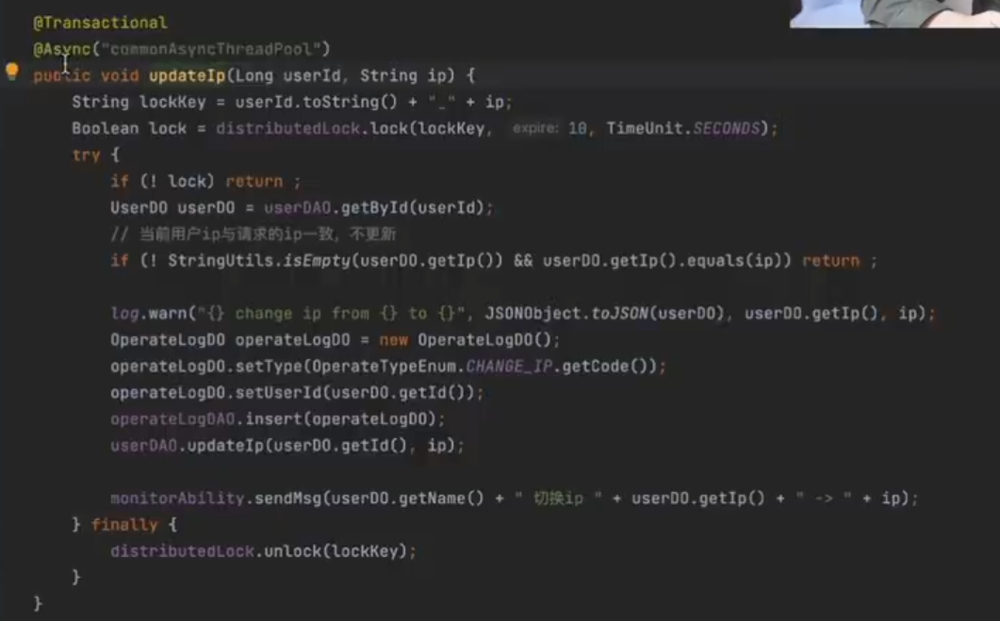
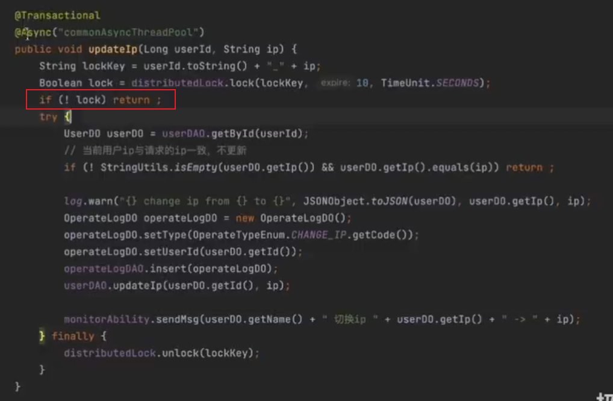
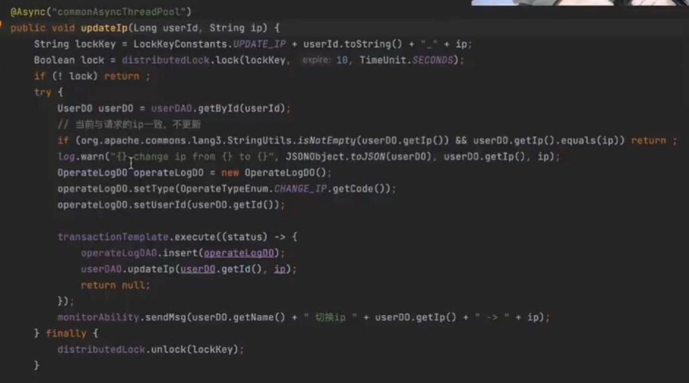

并发需要必要重要的两个点：

1. 数据的真确性
2. 性能在可接受的范围

在考虑数据的正确性的时候，我们一般是通过加锁的方式来保证数据的正确性，在加锁的过程中就需要考虑到加锁的粒度以及加锁的时长。

获取当前IP的切面：

demo:

实现目的防止一个账号给多个人同时使用：

1. 先判断当前账户的当前IP下当前线程是否获取过分布式锁。
2. 成功获取锁后获取信息判断IP是否一样。
3. 获取用户的操作日志以及更新用户IP信息保存在一个声明式事务中（需要保证原子性）。
4. 最后释放锁。

存在的问题：

1. 事务没有办法执行，因为在try里面，无法保证插入语句以及后面的更新语句的原子操作。
2. 释放锁的操作是在finally语句中，即使上面逻辑没有执行也会释放锁。

此时当在释放锁之后发生了等待，事务没有被提交，新线程获取的为更新前的数据。

声明式事务修改为编程式事务：

降低事务的粒度，减少连接池的消耗。

参考：

[并发编程有多难，值得反复研究的的两个案例！_哔哩哔哩_bilibili](https://www.bilibili.com/video/BV1ZQ4y1n7z3/?spm_id_from=333.999.0.0&vd_source=4caa5043b8a1c275c151a55999790076)