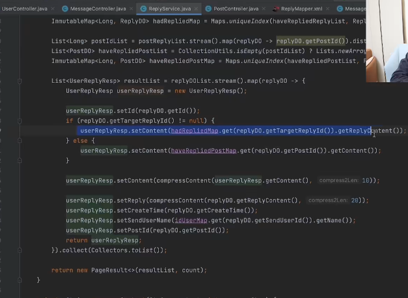
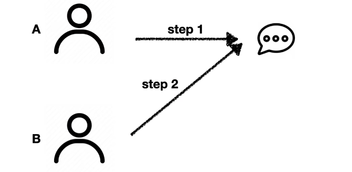
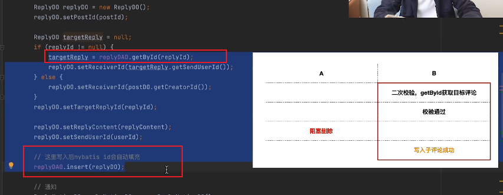
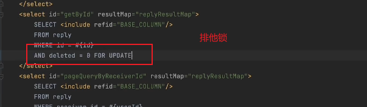
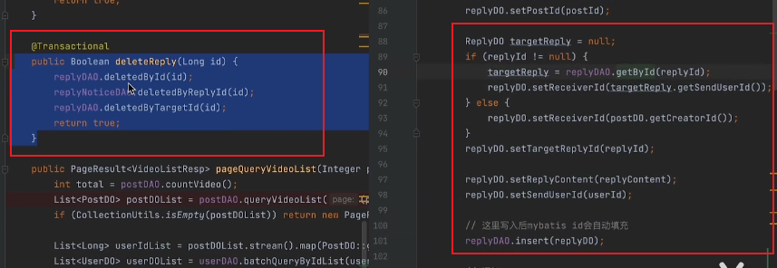

[经典并发场景分析，真的很难，但分析能力很重要！_哔哩哔哩_bilibili](https://www.bilibili.com/video/BV11w411K7JH/?spm_id_from=333.1007.tianma.6-2-20.click&vd_source=4caa5043b8a1c275c151a55999790076)
具体代码：

1. 场景：
   

A同学发了一个评论，此时B同学去评论A同学的评论，当B还没来得及回复的时候，A就将他的评论删除，此时B去回复评论的时候

就发现回复了一个不存在的评论，此时A再去查看自己的品论的时候，就发现找不到自己的评论了。
方案：

1. 当B在编辑这个评论框的时候，就将这个A这个评论锁住，不然其删除评论。（会影响用户体验）
2. 当提交评论的时候进行双重校验，在评论的时候再去判断一下该评论是否被删除掉了。当删除了，就会在页面提示当前评论不存在。

当第一处没有出现评论删除的情况，但是在二处评论被删除的时候。我们可以在第一处操作的时候加一个排他锁。

在查询的时候加上排他锁，此时当锁被释放了之后，
