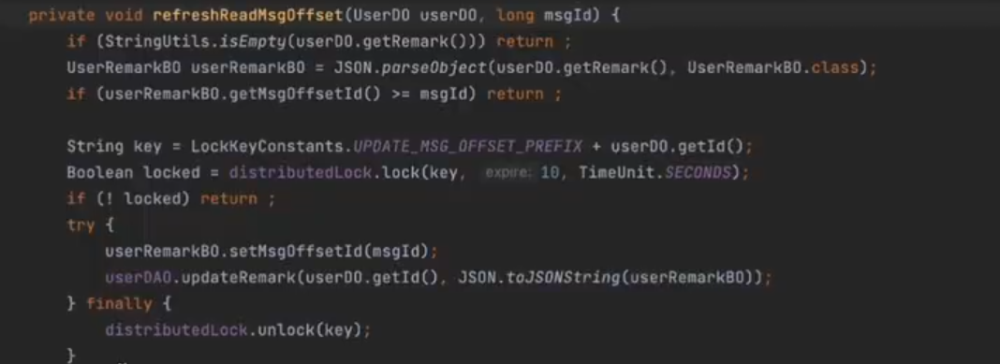
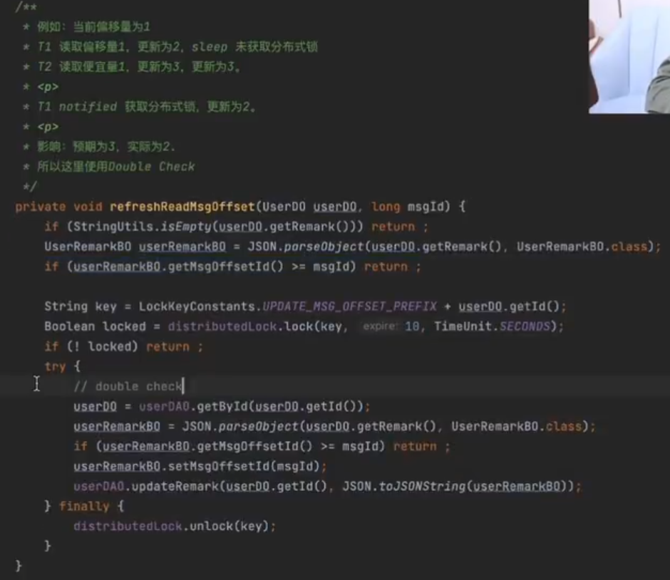

记录聊天室上一次聊天的位置：

逻辑：

1. 线判断上次的消息Id是否大于等于当前消息ID，是则直接返回；
2. 不是，怎会获取锁，同时更新消息的偏移量。

存在的问题：

1. 当前消息的偏移量为1
2. 线程A，将数据库的偏移量从1修改为2的时候并未获取锁。
3. 线程B，将数据库的偏移量从1修改为3之后，A获取锁，将值修改为2。
4. 预期结果是3，最后结果却为2。

时序上的并发问题。

并发问题是：动态的，失序的，时间分片等操作系统问题，以及数据库事务相关的问题。