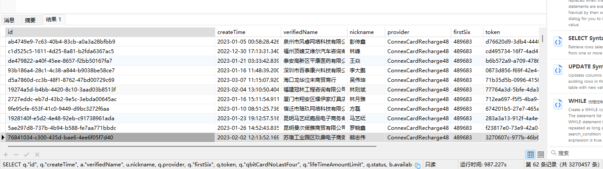

```
SELECT q."id", q."createTime", a."verifiedName", u.nickname, q.provider, q."firstSix", q.token, q."qbitCardNoLastFour", q."lifeTimeAmountLimit", q.status, b.available balance FROM "qbitCard" q LEFT JOIN (SELECT account."verifiedName", account."id" FROM account WHERE account."deleteTime" IS NULL) a ON a."id" = q."accountId" LEFT JOIN (SELECT balance.available, balance."id" FROM balance WHERE balance."deleteTime" IS NULL) b ON b.id = q."balanceId" LEFT JOIN (SELECT "user".nickname, "user"."id" FROM "user" WHERE "user"."deleteTime" IS NULL) u ON q."userId" = u."id" WHERE q."deleteTime" IS NULL AND q."accountId"::UUID IN (SELECT "accountId"::UUID FROM "salesAccountRelation" WHERE "deleteTime" IS NULL AND "salesId" IN ('31007c1a-976e-42ec-bd6c-c4ab9d61c02d'))
```



耗时：987.227s 查询记录：3270457

```
	SELECT q."id", q."createTime", q.provider, q."firstSix", q.token, q."qbitCardNoLastFour", q."lifeTimeAmountLimit", q.status FROM "qbitCard" q WHERE q."deleteTime" IS NULL
```

耗时：630.374s 查询记录：3270562