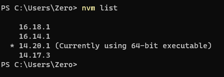
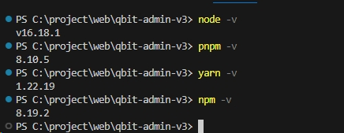
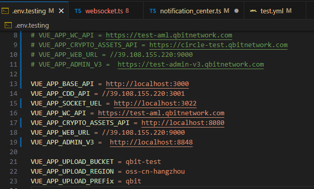
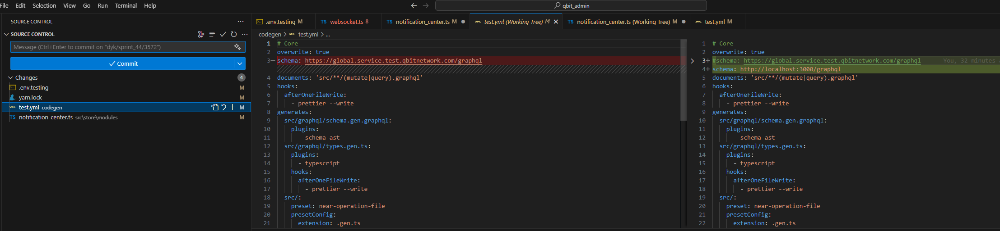
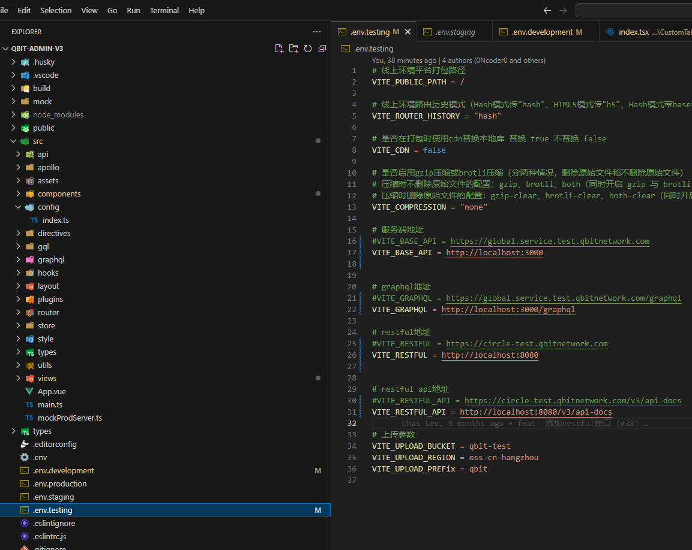

node版本：




**admin:**

yarn 

yarn codegen:test
yarn serve:test





**admin-V3:**



yarn

pnpm 处理

yarn serve:iframe

**notification:**
yarn
yarn start

**server:**
npm install
npm start

```yaml
export default {
  type: 'postgres',
  host: 'pgm-bp1mqp60787s06info.pg.rds.aliyuncs.com',
  port: 1921,
  username: 'qbit_admin',
  password: '8Ms8Ad0MKNkv',
  database: 'qbit_test_core',
  timezone: 'UTC',
  charset: 'utf8mb4',
  logging: true,
  autoLoadEntities: true,
  extra: {
    poolSize: 100,
  },
};
// export default {
//   type: 'postgres',
//   host: 'gp-rj962d9hiv2i1y81mo-master.gpdb.rds.aliyuncs.com',
//   port: 5432,
//   username: 'qbit_read',
//   password: 'wCAhSn!pr^u^^eJ!',
//   database: 'qbitpay_prod_core',
//   timezone: 'UTC',
//   charset: 'utf8mb4',
//   synchronize: false,
//   logging: true,
//   autoLoadEntities: true,
//   extra: {
//     poolSize: 100,
//   },
// };

```

