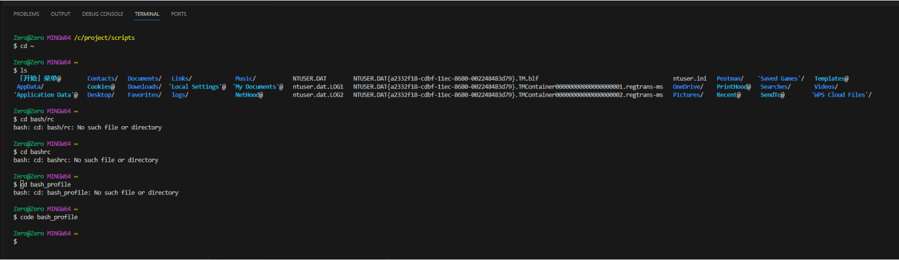
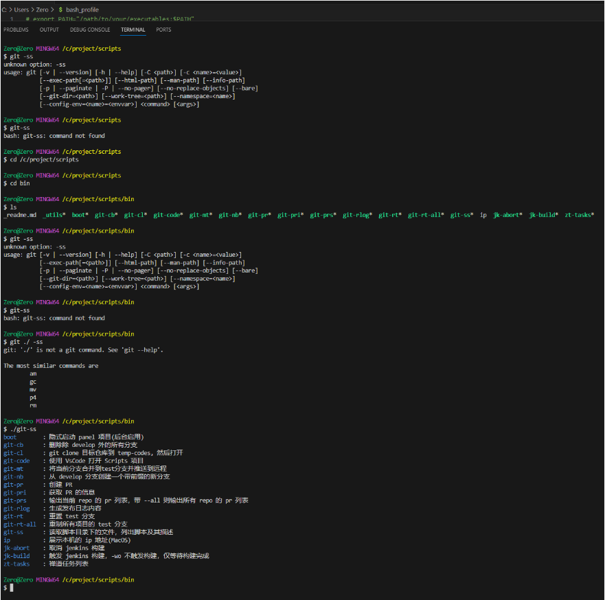

Zero@Zero MINGW64 /c/project/scripts
$ pwd
/c/project/scripts

Zero@Zero MINGW64 /c/project/scripts
$ 

 *  History restored 

Zero@Zero MINGW64 /c/project/scripts
$ source ~/.bash_profile

Zero@Zero MINGW64 /c/project/scripts
$ git-ss
boot        : 隐式启动 panel 项目(后台启用)
git-cb      : 删除除 develop 外的所有分支
git-cl      : git clone 目标仓库到 temp-codes, 然后打开
git-code    : 使用 VsCode 打开 Scripts 项目
git-mt      : 将当前分支合并到test分支并推送到远程
git-nb      : 从 develop 分支创建一个带前缀的新分支
git-pr      : 创建 PR
git-pri     : 获取 PR 的信息
git-prs     : 输出当前 repo 的 pr 列表，带 --all 则输出所有 repo 的 pr 列表
git-rlog    : 生成发布日志内容
git-rt      : 重置 test 分支
git-rt-all  : 重制所有项目的 test 分支
git-ss      : 读取脚本目录下的文件，列出脚本及其描述
ip          : 展示本机的 ip 地址(MacOS)
jk-abort    : 取消 jenkins 构建
jk-build    : 触发 jenkins 构建，-wo 不触发构建，仅等待构建完成
zt-tasks    : 禅道任务列表

Zero@Zero MINGW64 /c/project/scripts
$ git-nb sprint_44/query_opmition
git checkout develop
fatal: not a git repository (or any of the parent directories): .git
git pull
fatal: not a git repository (or any of the parent directories): .git
git checkout -b ZC/sprint_44/query_opmition
fatal: not a git repository (or any of the parent directories): .git
git push -u origin ZC/sprint_44/query_opmition
fatal: not a git repository (or any of the parent directories): .git
Current branch: ZC/sprint_44/query_opmition

Zero@Zero MINGW64 /c/project/scripts
$ ip

错误: 无法识别或不完整的命令行。

用法:
    ipconfig [/allcompartments] [/? | /all |
                                 /renew [adapter] | /release [adapter] |
                                 /renew6 [adapter] | /release6 [adapter] |
                                 /flushdns | /displaydns | /registerdns |
                                 /showclassid adapter |
                                 /setclassid adapter [classid] |
                                 /showclassid6 adapter |
                                 /setclassid6 adapter [classid] ]

其中
    adapter             连接名称
                       (允许使用通配符 * 和 ?，参见示例)

    选项:
       /?               显示此帮助消息
       /all             显示完整配置信息。
       /release         释放指定适配器的 IPv4 地址。
       /release6        释放指定适配器的 IPv6 地址。
       /renew           更新指定适配器的 IPv4 地址。
       /renew6          更新指定适配器的 IPv6 地址。
       /flushdns        清除 DNS 解析程序缓存。
       /registerdns     刷新所有 DHCP 租用并重新注册 DNS 名称
       /displaydns      显示 DNS 解析程序缓存的内容。
       /showclassid     显示适配器允许的所有 DHCP 类 ID。
       /setclassid      修改 DHCP 类 ID。
       /showclassid6    显示适配器允许的所有 IPv6 DHCP 类 ID。
       /setclassid6     修改 IPv6 DHCP 类 ID。

默认情况下，仅显示绑定到 TCP/IP 的每个适配器的 IP 地址、子网掩码和
默认网关。

对于 Release 和 Renew，如果未指定适配器名称，则会释放或更新所有绑定
到 TCP/IP 的适配器的 IP 地址租用。

对于 Setclassid 和 Setclassid6，如果未指定 ClassId，则会删除 ClassId。

示例:
    > ipconfig                       ... 显示信息
    > ipconfig /all                  ... 显示详细信息
    > ipconfig /renew                ... 更新所有适配器
    > ipconfig /renew EL*            ... 更新所有名称以 EL 开头
                                         的连接
    > ipconfig /release *Con*        ... 释放所有匹配的连接，
                                         例如“有线以太网连接 1”或
                                             “有线以太网连接 2”
    > ipconfig /allcompartments      ... 显示有关所有隔离舱的
                                         信息
    > ipconfig /allcompartments /all ... 显示有关所有隔离舱的
                                         详细信息

Zero@Zero MINGW64 /c/project/scripts
$ npm i
npm WARN my-zentao@1.0.0 No repository field.

added 72 packages from 165 contributors and audited 72 packages in 4.924s

2 packages are looking for funding
  run `npm fund` for details

found 1 moderate severity vulnerability
  run `npm audit fix` to fix them, or `npm audit` for details

Zero@Zero MINGW64 /c/project/scripts
$ zt-tasks
ts-node /c/project/scripts/bin/../src/zentao/get-tasks.ts
/c/project/scripts/bin/_utils: line 22: ts-node: command not found

Zero@Zero MINGW64 /c/project/scripts
$ npm i -g ts-node
C:\Users\Zero\AppData\Roaming\npm\ts-node-esm -> C:\Users\Zero\AppData\Roaming\npm\node_modules\ts-node\dist\bin-esm.js
C:\Users\Zero\AppData\Roaming\npm\ts-node-script -> C:\Users\Zero\AppData\Roaming\npm\node_modules\ts-node\dist\bin-script.js
C:\Users\Zero\AppData\Roaming\npm\ts-node-cwd -> C:\Users\Zero\AppData\Roaming\npm\node_modules\ts-node\dist\bin-cwd.js
C:\Users\Zero\AppData\Roaming\npm\ts-node -> C:\Users\Zero\AppData\Roaming\npm\node_modules\ts-node\dist\bin.js
C:\Users\Zero\AppData\Roaming\npm\ts-script -> C:\Users\Zero\AppData\Roaming\npm\node_modules\ts-node\dist\bin-script-deprecated.js
C:\Users\Zero\AppData\Roaming\npm\ts-node-transpile-only -> C:\Users\Zero\AppData\Roaming\npm\node_modules\ts-node\dist\bin-transpile.js
npm WARN ts-node@10.9.1 requires a peer of @types/node@* but none is installed. You must install peer dependencies yourself.
npm WARN ts-node@10.9.1 requires a peer of typescript@>=2.7 but none is installed. You must install peer dependencies yourself.

+ ts-node@10.9.1
added 17 packages from 11 contributors in 3.578s

Zero@Zero MINGW64 /c/project/scripts
$ zt-tasks
ts-node /c/project/scripts/bin/../src/zentao/get-tasks.ts
(node:18424) UnhandledPromiseRejectionWarning: AxiosError: Request failed with status code 400
    at settle (C:\project\scripts\node_modules\axios\lib\core\settle.js:19:12)
    at IncomingMessage.handleStreamEnd (C:\project\scripts\node_modules\axios\lib\adapters\http.js:570:11)
    at IncomingMessage.emit (events.js:387:35)
    at IncomingMessage.emit (domain.js:470:12)
    at endReadableNT (internal/streams/readable.js:1317:12)
    at processTicksAndRejections (internal/process/task_queues.js:82:21)
(Use `node --trace-warnings ...` to show where the warning was created)
(node:18424) UnhandledPromiseRejectionWarning: Unhandled promise rejection. This error originated either by throwing inside of an async function without a catch block, or by rejecting a promise which was not handled with .catch(). To terminate the node process on unhandled promise rejection, use the CLI flag `--unhandled-rejections=strict` (see https://nodejs.org/api/cli.html#cli_unhandled_rejections_mode). (rejection id: 2)
(node:18424) [DEP0018] DeprecationWarning: Unhandled promise rejections are deprecated. In the future, promise rejections that are not handled will terminate the Node.js process with a non-zero exit code.

Zero@Zero MINGW64 /c/project/scripts
$ zt-tasks
ts-node /c/project/scripts/bin/../src/zentao/get-tasks.ts

Zero@Zero MINGW64 /c/project/scripts
$ jk-bulid
bash: jk-bulid: command not found

Zero@Zero MINGW64 /c/project/scripts
$ jk-bulid java
bash: jk-bulid: command not found

Zero@Zero MINGW64 /c/project/scripts
$ jk-build java
ts-node /c/project/scripts/bin/../src/jenkins/build.ts java
{ jobName: 'test_java' }
{ queueId: 34618 }
waiting...
waiting...
waiting...
waiting...
waiting...
waiting...
waiting...
waiting...
waiting...
{ buildId: 2825 }
building... estimate 138.682s
building... estimate 137.451s
building... estimate 136.226s
building... estimate 134.976s
building... estimate 133.731s
building... estimate 132.493s
building... estimate 131.239s
building... estimate 130.019s
building... estimate 128.794s
building... estimate 127.566s
building... estimate 126.302s
building... estimate 125.068s
building... estimate 123.851s
building... estimate 122.607s
building... estimate 121.374s
building... estimate 120.141s
building... estimate 118.898s
building... estimate 117.663s
building... estimate 116.426s
building... estimate 115.201s
building... estimate 113.973s
building... estimate 112.766s
building... estimate 111.527s
building... estimate 110.308s
building... estimate 109.061s
building... estimate 107.833s
building... estimate 106.594s
building... estimate 105.365s
building... estimate 104.139s
building... estimate 102.907s
building... estimate 101.699s
building... estimate 100.472s
building... estimate 99.253s
building... estimate 97.96s
building... estimate 96.737s
building... estimate 95.517s
building... estimate 94.295s
building... estimate 93.063s
building... estimate 91.818s
building... estimate 90.587s
building... estimate 89.366s
building... estimate 88.142s
building... estimate 86.913s
building... estimate 85.677s
building... estimate 84.458s
building... estimate 83.21s
building... estimate 81.978s
building... estimate 80.739s
building... estimate 79.503s
building... estimate 78.255s
building... estimate 76.985s
building... estimate 75.735s
building... estimate 74.487s
building... estimate 73.255s
building... estimate 72.008s
building... estimate 70.791s
building... estimate 69.566s
building... estimate 68.207s
building... estimate 66.963s
building... estimate 65.728s
building... estimate 64.48s
building... estimate 63.251s
building... estimate 62.021s
building... estimate 60.801s
building... estimate 59.565s
building... estimate 58.327s
building... estimate 57.109s
building... estimate 55.888s
building... estimate 54.667s
building... estimate 53.434s
building... estimate 52.191s
building... estimate 50.968s
building... estimate 49.733s
building... estimate 48.51s
building... estimate 47.271s
building... estimate 46.037s
building... estimate 44.808s
building... estimate 43.558s
building... estimate 42.297s
building... estimate 41.078s
building... estimate 39.854s
building... estimate 38.627s
building... estimate 37.389s
building... estimate 36.156s
building... estimate 34.921s
building... estimate 33.7s
building... estimate 32.456s
building... estimate 31.223s
building... estimate 29.983s
building... estimate 28.749s
building... estimate 27.499s
building... estimate 26.25s
building... estimate 24.992s
building... estimate 23.771s
building... estimate 22.544s
test_java: build finished SUCCESS
https://test-jenkins.qbitnetwork.com/job/test_java/2825/console
osascript -e 'display notification "test_java: build finished SUCCESS" with title "Jenkins"'

Zero@Zero MINGW64 /c/project/scripts
$